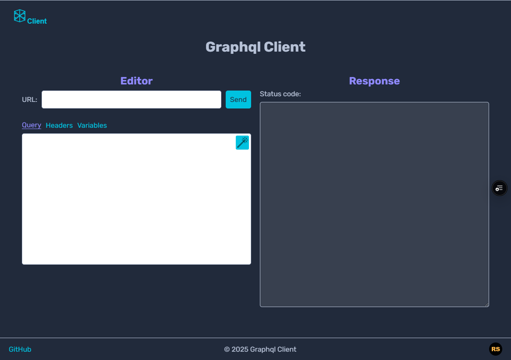
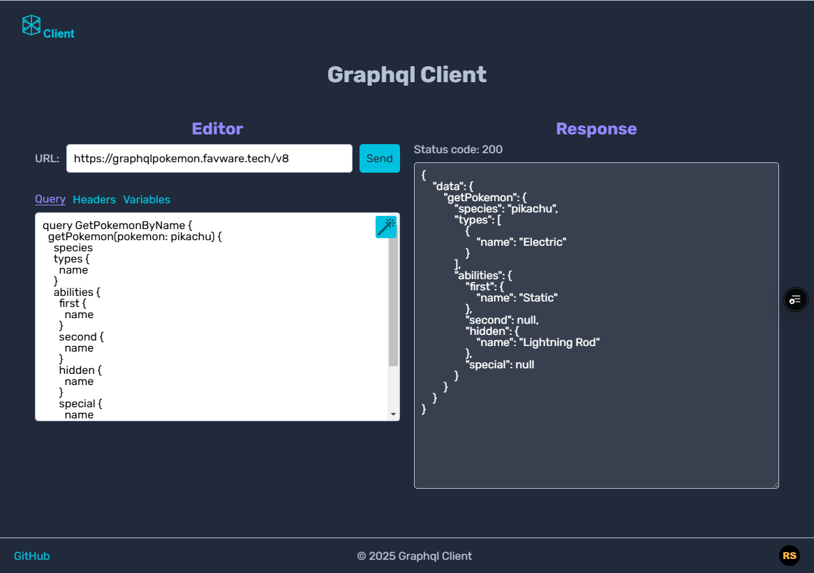

# Graphql Client

## Описание
Graphql Client — это веб-приложение для выполнения GraphQL-запросов. Оно позволяет легко задавать URL сервера, писать запросы, добавлять заголовки и переменные, чтобы тестировать и отлаживать API.

## Технологии
- **Next.js v15** (App Router)
- **CSS Modules** (стили)
- **Graphql** (запросы)
- **Husky** (pre-commit и pre-push хуки)
- **Vitest** (тестирование)
- **Prettier** (форматирование кода)
- **ESLint** (линтинг кода)

## Интерфейс приложения

Приложение предоставляет удобный интерфейс для работы с GraphQL-запросами:

- Поле для ввода URL сервера.
- Редактор для написания GraphQL-запросов.
- Возможность добавления заголовков.
- Поле для указания переменных.
- Кнопку выполнения запроса и просмотра результатов.
- Поле для указания SDL URL для загрузки схемы.
- Раздел документации, в котором отображаются загруженная схема или ошибки при её разборе.

Пример интерфейса:



## Пример GraphQL-запросов

Пример запроса к API [https://graphqlpokemon.favware.tech/v8](https://graphqlpokemon.favware.tech/v8):

```graphql
query GetPokemonByName {
  getPokemon(pokemon: pikachu) {
    species
    types {
      name
    }
    abilities {
      first {
        name
      }
      second {
        name
      }
      hidden {
        name
      }
      special {
        name
      }
    }
  }
}

```
Этот запрос получает информацию о покемоне Пикачу, включая его способности и типы.




Пример запроса к API [https://graphqlpokemon.favware.tech/v8](https://graphqlpokemon.favware.tech/v8) с использованием переменных:

```
query GetPokemonByName($pokemon: PokemonEnum!) {
  getPokemon(pokemon: $pokemon) {
    species
    types {
      name
    }
  }
}

```
Этот запрос получает название вида (species) и список типов (types) указанного покемона. Имя покемона передаётся через переменную $pokemon.

Переменные указываются в соответствующем блоке variables.


## Установка
```sh
# Клонируйте репозиторий
git clone <репозиторий>
cd <папка_проекта>

# Установите зависимости
npm install
```

## Скрипты
```json
"dev": "next dev",                 // Запуск dev-сервера
"build": "next build",             // Сборка приложения
"start": "next start",             // Запуск production-сервера
"lint:check": "next lint",         // Проверка ESLint
"lint:fix": "next lint --fix",     // Автофикс ошибок линтера
"format:check": "prettier --check ./src", // Проверка форматирования
"format:fix": "prettier --write ./src", // Форматирование кода
"ts:check": "tsc --noEmit",        // Проверка TypeScript
"prepare": "husky",                // Подготовка husky хуков
"bash:pre-commit": "bash .husky/pre-commit",   // Запуск pre-commit хука
"bash:pre-push": "bash .husky/pre-push",       // Запуск pre-push хука
"husky:pre-commit": "git hook run pre-commit", // Альтернативный запуск pre-commit
"husky:pre-push": "git hook run pre-push",     // Альтернативный запуск pre-push
"test": "vitest run",               // Запуск тестов
"coverage": "vitest run --coverage" // Запуск тестов с покрытием
```

## Запуск в разработке
```sh
npm run dev
```

## Сборка и запуск в production
```sh
npm run build
npm run start
```

## Тестирование
```sh
npm run test    # Запуск всех тестов
npm run coverage # Запуск тестов с отчетом о покрытии
```

## Форматирование и линтинг
```sh
npm run lint:check   # Проверка кода ESLint
npm run lint:fix     # Автофикс
npm run ts:check     # Проверка кода TypeScript
npm run format:check # Проверка форматирования
npm run format:fix   # Автоформатирование
```

## Pre-commit и pre-push хуки
Проект использует **Husky** для автоматического выполнения проверок перед коммитом и пушем.
```sh
npm run bash:pre-commit  # Запуск pre-commit вручную
npm run bash:pre-push    # Запуск pre-push вручную
```

## Структура проекта

```
/src
  /app            # Страницы Next.js (роутинг)
  /assets         # Статические файлы (изображения, шрифты и т. д.)
  /UI components  # Повторно используемые UI-компоненты
  /components     # Контейнерные компоненты с логикой
  /services       # Запросы к API, работа с GraphQL
  /utils          # Вспомогательные функции
  /types          # Основные типы
```

## Лицензия
MIT
